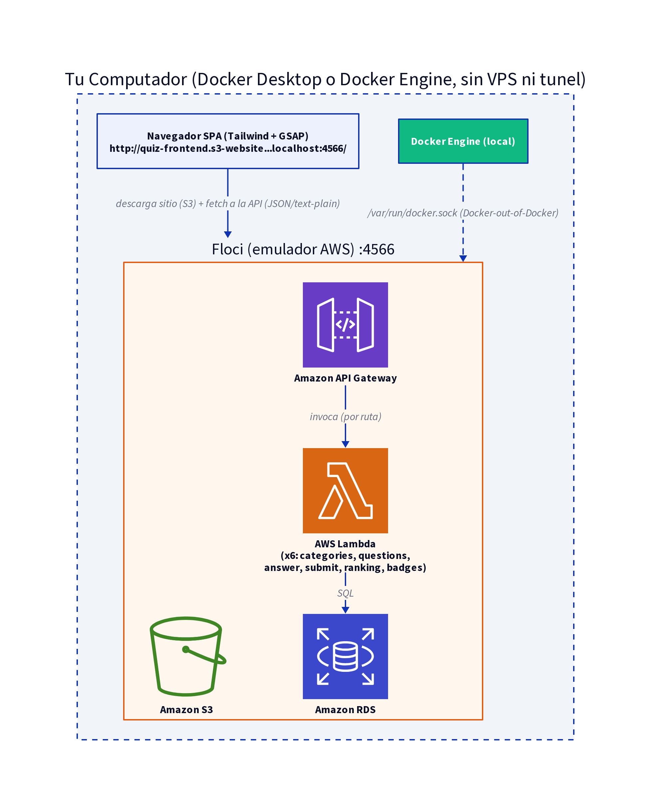

# Guía paso a paso: Quiz de AWS Cloud Practitioner (100% local, sin VPS)

**Para quién es este documento:** para quien ya hizo [`hello-world/GUIA-LOCAL-DOCKER.md`](../../hello-world/docs/GUIA-LOCAL-DOCKER.md) (Floci corriendo en tu propia máquina, AWS CLI, Lambda, IAM, Function URL) y quiere seguir aprendiendo construyendo una app serverless completa — **en la misma máquina, sin ningún VPS**. Si más adelante querés desplegar esto en un servidor remoto compartido, [`GUIA-PASO-A-PASO.md`](./GUIA-PASO-A-PASO.md) cubre esa diferencia; para aprender y practicar, este documento te alcanza solo.

**Objetivo de este documento:** construir una aplicación **serverless completa** (frontend + API REST + base de datos relacional) 100% en tu Docker local, y entender exactamente qué cambiaría para desplegarla en una cuenta de **AWS real**. Cada sección tiene una nota "**En AWS real...**" señalando las diferencias.

---

## Índice

1. [Qué vas a construir](#1-qué-vas-a-construir)
2. [Conceptos nuevos respecto a la guía de Hello World](#2-conceptos-nuevos-respecto-a-la-guía-de-hello-world)
3. [Arquitectura general](#3-arquitectura-general)
4. [Floci vs. AWS real: qué cambia](#4-floci-vs-aws-real-qué-cambia)
5. [Prerrequisitos](#5-prerrequisitos)
6. [Paso 1 — Modelo de datos](#paso-1--modelo-de-datos)
7. [Paso 2 — Base de datos (RDS)](#paso-2--base-de-datos-rds)
8. [Paso 3 — Cargar los datos](#paso-3--cargar-los-datos)
9. [Paso 4 — Las funciones Lambda](#paso-4--las-funciones-lambda)
10. [Paso 5 — API Gateway](#paso-5--api-gateway)
11. [Paso 6 — Frontend (Tailwind + GSAP + S3)](#paso-6--frontend-tailwind--gsap--s3)
12. [Flujo completo de una partida](#12-flujo-completo-de-una-partida)
13. [ETAPA final — Limpieza](#etapa-final--limpieza)
14. [Problemas comunes](#14-problemas-comunes)
15. [Checklist para desplegar en AWS real](#15-checklist-para-desplegar-en-aws-real)
16. [Glosario](#16-glosario)

---

## 1. Qué vas a construir

Un quiz de preguntas de AWS Cloud Practitioner con:

- Selector de categoría, cantidad de preguntas, avatar y color de perfil.
- Preguntas con **respuesta inmediata** (correcto/incorrecto al toque, sin esperar al final).
- Sistema de **puntos + racha**, **medallas/logros**, **ranking** y **modo claro/oscuro**.
- Todo corriendo sobre servicios "AWS" (S3, API Gateway, Lambda, RDS) — emulados por el mismo Floci que ya tenés corriendo en tu máquina desde la guía de Hello World, con el mismo código y los mismos comandos que usarías contra la nube real.

---

## 2. Conceptos nuevos respecto a la guía de Hello World

Si ya hiciste el Hello World, ya sabes qué es Lambda, IAM, y cómo apuntar el AWS CLI a un endpoint local. Esta sección cubre lo nuevo.

### 2.1 De una función a una API completa

El Hello World tenía **una** Lambda con una Function URL. Este proyecto tiene **6 Lambdas** (`categories`, `questions`, `answer`, `submit`, `ranking`, `badges`), cada una haciendo una sola cosa (principio de responsabilidad única), todas detrás de un único **API Gateway**. En vez de una URL por función, tienes **una API con varias rutas**:

```
GET  /categories
GET  /questions/{categoria}
POST /answer
POST /submit
GET  /ranking
GET  /badges
```

Esto es el patrón real que vas a encontrar en casi cualquier backend serverless en producción: **API Gateway como "puerta de entrada" única**, que enruta cada combinación método+ruta a la Lambda que corresponda.

### 2.2 Bases de datos relacionales en la nube (RDS)

Hasta ahora no habíamos necesitado guardar nada permanente. Este proyecto sí: preguntas, opciones, explicaciones y el ranking viven en una base de datos **Postgres real** (RDS = *Relational Database Service*, el servicio de AWS para bases de datos relacionales administradas — no tienes que instalar ni parchear el motor de base de datos tú mismo, AWS lo hace).

Un Lambda que necesita hablarle a la base de datos:
1. Se conecta con credenciales (usuario/contraseña + host/puerto).
2. Ejecuta SQL normal (`SELECT`, `INSERT`, etc.) con una librería cliente (`pg` en nuestro caso, para Node.js).
3. Cierra la conexión al terminar (importante: Lambda no es un servidor de larga duración, cada invocación abre y cierra su propia conexión).

### 2.3 CORS (Cross-Origin Resource Sharing)

Cuando tu frontend (servido desde un dominio/puerto) llama a una API en **otro** dominio/puerto, el navegador aplica una política de seguridad llamada CORS: por defecto, **bloquea** esa llamada, a menos que el servidor responda explícitamente "sí, acepto peticiones desde ese origen".

Para peticiones "no simples" (por ejemplo, un `POST` con `Content-Type: application/json`), el navegador primero manda una petición de **preflight** (`OPTIONS`) preguntando "¿puedo hacer esta petición?", y solo si la respuesta lo autoriza, manda la petición real. Esto explica un detalle que vas a ver en el código: usamos `Content-Type: text/plain` en vez de `application/json` para evitar el preflight contra una limitación puntual del emulador (ver sección 4).

### 2.4 Por qué el puntaje se calcula en el servidor (integridad de datos)

Acá es central: **el cliente (navegador) nunca es una fuente confiable**. Cualquiera puede abrir las herramientas de desarrollador y cambiar variables de JavaScript. Por eso:

- `/answer` y `/submit` **siempre** recalculan la corrección de cada respuesta consultando la base de datos — nunca confían en un campo `correcta: true` que pudiera venir manipulado desde el navegador.
- El puntaje final, la racha y el puesto en el ranking se calculan **en la Lambda**, no en el navegador (el navegador solo *muestra* un cálculo optimista en vivo, para que se sienta inmediato, pero lo que se guarda es siempre el cálculo del servidor).

### 2.5 Hosting estático de un SPA (Single Page Application) completo

En el Hello World servimos una sola página. Acá el frontend es una aplicación de una sola página (SPA) con **varias pantallas** (categorías, perfil, preguntas, resultado, ranking) que se renderizan todas con JavaScript en el navegador, sin recargar la página. Aun así, se sirve exactamente igual que cualquier sitio estático: son solo 3 archivos (`index.html`, `style.css`, `app.js`) subidos a un bucket S3 con *static website hosting* habilitado.

---

## 3. Arquitectura general



Resumen del flujo: tu navegador carga el frontend estático desde S3 directamente (`http://quiz-frontend.s3-website...localhost:4566/`, sin túnel — es tu propia máquina), y llama a la API (API Gateway → Lambda → RDS) para todo lo dinámico. Todo esto corre dentro del mismo contenedor de Floci que ya levantaste para el Hello World.

### 3.1 Cómo se vería en una cuenta de AWS real (VPC, región, Availability Zones)

El diagrama de arriba es fiel a **Floci**, pero no muestra algo que sí existe en AWS real: cada cuenta tiene **regiones** (ej. `us-east-1`), cada región tiene varias **Availability Zones** físicamente separadas (para tolerar que una se caiga sin afectar a las demás), y los recursos "de red privada" (Lambda con acceso a RDS, la propia RDS) viven dentro de una **VPC** con subredes públicas/privadas — nada de esto es visible al trabajar contra Floci, porque Floci no emula la capa de red, solo el comportamiento de cada servicio.


Diagrama editable en Lucid: [AWS-FLOCI - Arquitectura AWS real v2](https://lucid.app/lucidchart/c4f12314-8380-4842-9325-4508233b6a52/edit)

Ideas clave que este segundo diagrama agrega sobre el primero:

- **Región**: unidad geográfica de más alto nivel (ej. `us-east-1`, Virginia). Todo lo demás vive dentro de una región.
- **VPC (Virtual Private Cloud)**: tu red privada aislada dentro de la región. RDS y las Lambdas que necesitan hablarle a RDS viven dentro de una VPC; S3, API Gateway y Route 53 son servicios **regionales**, no viven "dentro" de ninguna VPC (por eso en el diagrama quedan fuera del rectángulo de la VPC).
- **Availability Zone (AZ)**: un centro de datos físicamente independiente dentro de la región (con su propia energía, refrigeración, red). Una región real tiene 3 o más. Repartir recursos entre AZs es lo que te da tolerancia a fallos "de verdad" (si una AZ entera se cae, la app sigue funcionando desde la otra).
- **Subred pública vs. privada**: una subred pública tiene ruta directa a un **Internet Gateway** (recursos con IP pública); una privada no — solo sale a internet indirectamente vía un **NAT Gateway** (útil para que, por ejemplo, una Lambda pueda llamar a una API externa sin exponer la base de datos al mundo). En este proyecto, Lambda y RDS viven en subred **privada** — nunca necesitan ser alcanzables directamente desde internet, solo entre sí y desde API Gateway (que sí es público).
- **RDS Multi-AZ**: en producción real, se recomienda una instancia RDS **primaria** en una AZ y una **standby** en otra, replicadas de forma síncrona — si la AZ de la primaria falla, AWS conmuta a la standby automáticamente. Floci no emula esto (una sola instancia, sin AZs), pero es la práctica estándar en una cuenta real.

---

## 4. Floci vs. AWS real: qué cambia

Esta es la sección más importante si tu objetivo es migrar esto a una cuenta de AWS real. La lógica de negocio (el código de las Lambdas, el esquema SQL, el frontend) **es exactamente el mismo**. Lo que cambia es la capa de infraestructura y algunos detalles operativos:

| Aspecto | En Floci (este proyecto) | En AWS real |
|---|---|---|
| **Tiempo de aprovisionamiento** | `aws rds create-db-instance` responde en segundos (`"DBInstanceStatus": "available"` inmediato) | Puede tardar **varios minutos** (a veces 10-15) en pasar de `creating` a `available`. Hay que esperar/consultar con `aws rds describe-db-instances` |
| **Red de la RDS** | Endpoint interno de Docker (mismo contenedor de Floci, puerto propio por instancia — confirmalo con `describe-db-instances`, no lo asumas), alcanzable solo desde contenedores en la misma red Docker | Vive dentro de una **VPC** (red privada), con **Security Groups** que debes configurar explícitamente para permitir que tus Lambdas se conecten (regla de entrada en el puerto 5432 desde el Security Group de las Lambdas) |
| **Conectividad Lambda → RDS** | Automática: Floci conecta los contenedores Lambda a la misma red Docker | Debes configurar tus Lambdas para que corran **dentro de la misma VPC** que la RDS (`--vpc-config` con subnets y security groups) — sin esto, la Lambda no puede alcanzar la base de datos |
| **Contraseña de la base de datos** | Variable de entorno en texto plano (`PGPASSWORD=...`) | Se recomienda **AWS Secrets Manager** para guardar y rotar la credencial, en vez de dejarla en texto plano en la configuración de la Lambda |
| **CORS en API Gateway** | La ruta interna de invocación de Floci (`_user_request_`) no procesa bien el preflight `OPTIONS`, por eso el frontend usa `Content-Type: text/plain` como workaround | El `--cors-configuration` de API Gateway **funciona correctamente out-of-the-box**; no necesitas el workaround, puedes usar `application/json` sin problema |
| **URL de invocación de la API** | Patrón interno `http://localhost:4566/restapis/{api_id}/{stage}/_user_request_/{ruta}` | URL pública real: `https://{api_id}.execute-api.{region}.amazonaws.com/{stage}/{ruta}` (HTTPS) |
| **Hosting del frontend (S3)** | Acceso directo (en tu propia máquina) a `http://{bucket}.s3-website.{region}.localhost:4566/`, sin necesidad de hacerlo público | Para que cualquiera pueda ver el sitio, el bucket necesita una **bucket policy pública** (o, mejor práctica, **CloudFront** delante del bucket, con el bucket en privado) |
| **HTTPS** | No aplica | API Gateway ya da HTTPS por defecto; para el frontend en S3 necesitas CloudFront + un certificado de **AWS Certificate Manager (ACM)** si quieres un dominio propio con HTTPS |
| **IAM** | El rol de cada Lambda solo tiene la *trust policy* (quién puede asumirlo); Floci no aplica permisos reales | Debes adjuntar también una **política de permisos** (qué puede hacer el rol), aunque sea mínima como `AWSLambdaBasicExecutionRole` para poder escribir logs a CloudWatch |
| **Logs** | `docker logs` del contenedor de la Lambda | **Amazon CloudWatch Logs**, con `aws logs tail /aws/lambda/quiz-submit --follow` |
| **Costo** | $0, todo local | Cada servicio tiene costo real (RDS por hora + almacenamiento, Lambda por invocación, API Gateway por petición, S3 por almacenamiento/transferencia) |

**Conclusión práctica:** si migras esto a AWS real, el 90% del trabajo (SQL, código de las Lambdas, HTML/CSS/JS del frontend) se reutiliza tal cual. El 10% que cambia es exactamente lo de esta tabla: crear una VPC con Security Groups, adjuntar políticas IAM reales, esperar los tiempos de aprovisionamiento reales, y decidir cómo exponer el sitio públicamente (bucket público vs. CloudFront).

---

## 5. Prerrequisitos

- Haber completado [`hello-world/GUIA-LOCAL-DOCKER.md`](../../hello-world/docs/GUIA-LOCAL-DOCKER.md): Floci corriendo en Docker en tu propia máquina, y el perfil de AWS CLI `floci-local` configurado. **Este proyecto reutiliza ese mismo Floci** — no hace falta levantar un contenedor nuevo ni crear otro perfil; es exactamente el mismo emulador, simplemente con más recursos adentro (una RDS, 6 Lambdas más, otra API Gateway, otro bucket).
- Verificá que seguís pudiendo hablarle:
  ```bash
  aws s3 ls --profile floci-local
  ```
- Anotá el nombre real de tu red Docker (lo necesitás en el Paso 2 y 3 para los `docker run --network ...`):
  ```bash
  docker network ls | grep default
  ```

---

## Paso 1 — Modelo de datos

Archivo: [`db/schema.sql`](../db/schema.sql)

```sql
CREATE TABLE categorias (
    id SERIAL PRIMARY KEY,
    nombre TEXT NOT NULL,
    slug TEXT NOT NULL UNIQUE
);

CREATE TABLE preguntas (
    id INTEGER PRIMARY KEY,
    categoria_id INTEGER NOT NULL REFERENCES categorias(id),
    enunciado TEXT NOT NULL,
    enunciado_en TEXT,
    es_multiple BOOLEAN NOT NULL DEFAULT FALSE
);

CREATE TABLE opciones (
    id SERIAL PRIMARY KEY,
    pregunta_id INTEGER NOT NULL REFERENCES preguntas(id),
    texto TEXT NOT NULL,
    es_correcta BOOLEAN NOT NULL DEFAULT FALSE,
    orden INTEGER NOT NULL
);

CREATE TABLE explicaciones (
    pregunta_id INTEGER PRIMARY KEY REFERENCES preguntas(id),
    explicacion TEXT NOT NULL,
    tip TEXT,
    pistas JSONB,
    glosario JSONB
);

CREATE TABLE ranking (
    id SERIAL PRIMARY KEY,
    username TEXT NOT NULL,
    puntaje INTEGER NOT NULL,
    categoria_id INTEGER NOT NULL REFERENCES categorias(id),
    fecha TIMESTAMPTZ NOT NULL DEFAULT now(),
    avatar TEXT,
    color TEXT,
    aciertos INTEGER,
    total INTEGER,
    mejor_racha INTEGER,
    puesto_logrado INTEGER
);

CREATE INDEX idx_opciones_pregunta ON opciones(pregunta_id);
CREATE INDEX idx_preguntas_categoria ON preguntas(categoria_id);
CREATE INDEX idx_ranking_categoria_puntaje ON ranking(categoria_id, puntaje DESC);

INSERT INTO categorias (nombre, slug) VALUES
    ('AWS Cloud Practitioner', 'aws-cloud-practitioner'),
    ('Python', 'python'),
    ('Linux', 'linux');
```

**Por qué estas decisiones de diseño:**

- `preguntas.id` reutiliza el ID original de la fuente de datos en vez de generar uno nuevo con `SERIAL` — así las referencias entre archivos de origen (preguntas ↔ explicaciones) se mantienen consistentes.
- `pistas` y `glosario` son `JSONB` (tipo nativo de Postgres) en vez de tablas separadas: son datos de solo lectura para mostrar en la UI, normalizarlos en más tablas sería complejidad sin beneficio real.
- `ranking.puesto_logrado` guarda el puesto **en el momento del intento**, no se recalcula después. Esto importa para las medallas "Podio"/"Campeón": si no se guardara, alguien podría perder una medalla ya ganada simplemente porque otro jugador mejoró el ranking más tarde.
- Índices en las columnas que se usan en `WHERE`/`ORDER BY` de las consultas más frecuentes (`opciones.pregunta_id`, `preguntas.categoria_id`, `ranking.categoria_id + puntaje`).

> **En AWS real**: este SQL se ejecuta exactamente igual, ya sea contra RDS Postgres real o Aurora Postgres. No hay ningún cambio necesario aquí.

---

## Paso 2 — Base de datos (RDS)


```bash
aws rds create-db-instance \
  --db-instance-identifier quiz-db \
  --db-instance-class db.t3.micro \
  --engine postgres \
  --engine-version 17 \
  --master-username quizadmin \
  --master-user-password 'TU_PASSWORD_SEGURO' \
  --allocated-storage 20 \
  --db-name quiz \
  --profile floci-local
```

En Floci, esto responde de inmediato con `"DBInstanceStatus": "available"` y un `Endpoint`. **No asumas la dirección** (puede no ser la misma que en el VPS) — consultala:

```bash
aws rds describe-db-instances --db-instance-identifier quiz-db --profile floci-local \
  --query 'DBInstances[0].Endpoint' --output json
```

Guardá el `Address` y el `Port` que te devuelva (usalos en el resto de esta guía en vez de copiar un valor fijo). Esa dirección es interna de la red Docker de tu Floci — no está publicada a tu máquina directamente — así que para ejecutar SQL contra ella (aplicar el esquema, cargar datos) lo hacemos desde un contenedor efímero conectado a esa misma red Docker (el nombre que anotaste en los Prerrequisitos):

```bash
docker run --rm --network <tu-red-docker> \
  -v /ruta/a/schema.sql:/schema.sql:ro \
  -e PGPASSWORD="tu_password" \
  postgres:17-alpine \
  psql "postgresql://quizadmin@<ADDRESS>:<PORT>/quiz" -f /schema.sql
```

**Verificar que el esquema se aplicó**:

```bash
docker run --rm --network <tu-red-docker> \
  -e PGPASSWORD="tu_password" \
  postgres:17-alpine \
  psql "postgresql://quizadmin@<ADDRESS>:<PORT>/quiz" -c "\dt"
```

Deberías ver las 5 tablas (`categorias`, `preguntas`, `opciones`, `explicaciones`, `ranking`).


> **En AWS real**: el mismo comando `create-db-instance` necesita además `--vpc-security-group-ids` y `--db-subnet-group-name` (para indicar en qué VPC/subnets vive). Y hay que **esperar** (`aws rds wait db-instance-available`) antes de poder conectarte, ya que el aprovisionamiento real toma minutos. Para ejecutar el `schema.sql`, si la RDS no es públicamente accesible (recomendado), necesitas hacerlo desde una instancia EC2/Lambda dentro de la misma VPC, o abrir un túnel a través de un *bastion host*.

---

## Paso 3 — Cargar los datos

Script: [`db/seed.js`](../db/seed.js) — lee los JSON de origen y los inserta respetando el esquema (preguntas, opciones marcando cuál es correcta, explicaciones). Se corre una sola vez:

```bash
docker run --rm --network <tu-red-docker> \
  -v /ruta/a/db:/app/db -w /app/db \
  -e PGHOST=<ADDRESS> -e PGPORT=<PORT> -e PGUSER=quizadmin -e PGPASSWORD="tu_password" -e PGDATABASE=quiz \
  node:22-alpine \
  sh -c "npm install --silent && node seed.js"
```

Resultado esperado: `169 preguntas, 697 opciones, 169 explicaciones` cargadas.

> **En AWS real**: igual, solo cambia desde dónde se ejecuta (una máquina con acceso de red a la RDS — VPN, bastion host, o una tarea temporal en la misma VPC).

---

## Paso 4 — Las funciones Lambda


Las 6 funciones comparten el mismo patrón: reciben el evento de API Gateway (formato *payload v2*), parsean el body si es `POST`, hacen su consulta a Postgres con el cliente `pg`, y devuelven `{statusCode, headers, body}`. Todas tienen su propio rol IAM (`quiz-<nombre>-role`) con la misma *trust policy* que ya usamos en el Hello World.

### 4.1 `categories` — `GET /categories`

```javascript
const { Client } = require("pg");

exports.handler = async () => {
  const client = new Client();
  await client.connect();
  try {
    const { rows } = await client.query(`
      SELECT c.slug, c.nombre, COUNT(p.id) > 0 AS tiene_preguntas
      FROM categorias c
      LEFT JOIN preguntas p ON p.categoria_id = c.id
      GROUP BY c.id, c.slug, c.nombre
      ORDER BY c.id
    `);
    return respond(200, rows);
  } finally {
    await client.end();
  }
};

function respond(statusCode, obj) {
  return { statusCode, headers: { "Content-Type": "application/json", "Access-Control-Allow-Origin": "*" }, body: JSON.stringify(obj) };
}
```

Lo interesante: `tiene_preguntas` se calcula con un `COUNT(*)`, no es un flag manual — así, el día que se carguen preguntas de Python o Linux, aparecen automáticamente como "Disponible" sin tocar código.

### 4.2 `questions` — `GET /questions/{categoria}`

Devuelve las preguntas de una categoría **sin** revelar cuál opción es la correcta ni la explicación (eso solo se entrega a través de `/answer`, después de responder). Código completo: [`lambda/questions/index.js`](../lambda/questions/index.js).

### 4.3 `answer` — `POST /answer` (la respuesta inmediata)

Esta función es la clave de la "respuesta inmediata": se llama **una vez por pregunta respondida**, no al final. Revela la corrección de esa pregunta puntual — nunca las demás, que el usuario todavía no vio. Código completo: [`lambda/answer/index.js`](../lambda/answer/index.js).

### 4.4 `submit` — `POST /submit` (calcula puntaje, racha, puesto y medallas)

Recorre las respuestas **en orden**, recalculando correcta/incorrecta desde la base de datos (nunca confía en lo que diga el cliente), acumula puntaje (100 puntos base + 20 de bonus por cada racha consecutiva), calcula el puesto en el ranking, y evalúa las 7 medallas consultando todo el historial del username. Código completo: [`lambda/submit/index.js`](../lambda/submit/index.js).

### 4.5 `ranking` — `GET /ranking?categoria=X`

```sql
SELECT r.username, r.puntaje, r.avatar, r.color, r.aciertos, r.total, r.mejor_racha, c.slug AS categoria, r.fecha
FROM ranking r JOIN categorias c ON c.id = r.categoria_id
WHERE c.slug = $1
ORDER BY r.puntaje DESC, r.fecha ASC
LIMIT 20
```

### 4.6 `badges` — `GET /badges?username=X` (medallas/logros)

Evalúa **todo el historial** del username (todas las categorías, todos los intentos) con una sola consulta agregada. Código completo: [`lambda/badges/index.js`](../lambda/badges/index.js).

### Desplegar cada Lambda (mismo patrón que el Hello World, ×6)

```bash
# Rol IAM (una vez por funcion)
aws iam create-role --role-name quiz-categories-role --assume-role-policy-document '{
  "Version": "2012-10-17",
  "Statement": [{"Effect": "Allow", "Principal": {"Service": "lambda.amazonaws.com"}, "Action": "sts:AssumeRole"}]
}' --profile floci-local

# Empaquetar (incluye node_modules con la libreria pg)
cd lambda/categories && npm install && zip -r function.zip index.js package.json node_modules

# Publicar, con las credenciales de RDS (del Paso 2) como variables de entorno
aws lambda create-function \
  --function-name quiz-categories \
  --runtime nodejs22.x \
  --role arn:aws:iam::000000000000:role/quiz-categories-role \
  --handler index.handler \
  --zip-file fileb://function.zip \
  --environment 'Variables={PGHOST=<ADDRESS>,PGPORT=<PORT>,PGUSER=quizadmin,PGPASSWORD=tu_password,PGDATABASE=quiz}' \
  --profile floci-local
```

Se repite para `questions`, `answer`, `submit`, `ranking`, `badges` (mismo patrón, cambiando el nombre en las 4 apariciones: rol, carpeta, `--function-name`, ARN del rol).

**Verificar que las 6 quedaron desplegadas**:

```bash
aws lambda list-functions --profile floci-local --query 'Functions[].FunctionName' --output table
```

Deberías ver `quiz-categories`, `quiz-questions`, `quiz-answer`, `quiz-submit`, `quiz-ranking`, `quiz-badges`. Para probar una puntual sin pasar por la API Gateway todavía:

```bash
aws lambda invoke --function-name quiz-categories --profile floci-local salida.json && cat salida.json
```


> **En AWS real**: agregar `--vpc-config SubnetIds=subnet-xxx,subnet-yyy,SecurityGroupIds=sg-xxx` para que la Lambda pueda alcanzar la RDS (están en la misma VPC), y usar Secrets Manager para `PGPASSWORD` en vez de una variable de entorno plana.

---

## Paso 5 — API Gateway


```bash
# 1. Crear la API HTTP con CORS
aws apigatewayv2 create-api --name quiz-api --protocol-type HTTP \
  --cors-configuration AllowOrigins="*",AllowMethods="GET,POST,OPTIONS",AllowHeaders="content-type" \
  --profile floci-local
# -> guarda el ApiId devuelto

# 2. Por cada Lambda: integracion + ruta + permiso
aws apigatewayv2 create-integration --api-id $API_ID \
  --integration-type AWS_PROXY \
  --integration-uri arn:aws:lambda:us-east-1:000000000000:function:quiz-categories \
  --payload-format-version 2.0 --profile floci-local
# -> guarda el IntegrationId

aws apigatewayv2 create-route --api-id $API_ID --route-key "GET /categories" \
  --target integrations/$INTEGRATION_ID --profile floci-local

aws lambda add-permission --function-name quiz-categories \
  --statement-id apigw-invoke --action lambda:InvokeFunction \
  --principal apigateway.amazonaws.com \
  --source-arn "arn:aws:execute-api:us-east-1:000000000000:${API_ID}/*/*" \
  --profile floci-local

# 3. Repetir el paso 2 para: GET /questions/{categoria}, POST /answer,
#    POST /submit, GET /ranking, GET /badges

# 4. Crear el stage
aws apigatewayv2 create-stage --api-id $API_ID --stage-name '$default' --auto-deploy --profile floci-local
```

**Verificar la API y sus rutas**:

```bash
aws apigatewayv2 get-apis --profile floci-local --query 'Items[].{Id:ApiId,Name:Name}' --output table
aws apigatewayv2 get-routes --api-id $API_ID --profile floci-local --query 'Items[].RouteKey' --output table
```

**Invocar la API**: en Floci, el patrón de invocación (descubierto empíricamente, no documentado) es:

```
http://localhost:4566/restapis/{api_id}/$default/_user_request_/{ruta}
```

Probalo directo con `curl` antes de tocar el frontend:

```bash
curl http://localhost:4566/restapis/$API_ID/\$default/_user_request_/categories
```


> **En AWS real**: la URL de invocación es simplemente `https://{api_id}.execute-api.{region}.amazonaws.com/{ruta}` (con `$default` como stage implícito) — no hace falta ningún patrón especial, es una URL pública HTTPS normal.

---

## Paso 6 — Frontend (Tailwind + GSAP + S3)


### Estructura

```
frontend/
├── index.html          # se sube a S3
├── style.css           # se sube a S3 (compilado, NO se edita a mano)
├── app.js              # se sube a S3
├── src/input.css       # fuente de Tailwind, NO se sube
├── package.json        # build de Tailwind, NO se sube
└── node_modules/       # NO se sube
```

### Build de Tailwind (v4)

```bash
cd frontend
npm install
npm run build:css   # tailwindcss -i src/input.css -o style.css --minify
```

### Patrón de la aplicación (SPA sin framework)

`app.js` es una única función `render(html)` que reemplaza el contenido de un `<div id="screen-root">` completo cada vez que cambias de pantalla, más 7 funciones `render<Pantalla>()` (Landing, Categorías, Nivel, Perfil, Pregunta, Resultado, Ranking) que arman el HTML como *template strings* y enganchan sus propios `addEventListener`. No hay Virtual DOM ni framework: se opta por simplicidad dado el tamaño del proyecto. GSAP (cargado por CDN, sin build) anima transiciones, la barra de progreso, el contador del puntaje final y el confeti.

**Importante:** el `API_BASE` en `app.js` tiene que apuntar a tu `$API_ID` local (el de este Floci, no el del VPS) — actualizalo antes de desplegar.

### Desplegar a S3

```bash
aws s3 mb s3://quiz-frontend --profile floci-local
aws s3api put-bucket-website --bucket quiz-frontend \
  --website-configuration '{"IndexDocument":{"Suffix":"index.html"}}' --profile floci-local

# Solo los 3 archivos servidos, con --cache-control para que las
# actualizaciones se reflejen de inmediato en el navegador
aws s3 cp index.html s3://quiz-frontend/index.html --cache-control "no-cache" --profile floci-local
aws s3 cp style.css s3://quiz-frontend/style.css --cache-control "no-cache" --profile floci-local
aws s3 cp app.js s3://quiz-frontend/app.js --cache-control "no-cache" --profile floci-local
```

**Verificar el bucket**:

```bash
aws s3api get-bucket-website --bucket quiz-frontend --profile floci-local
```

Acceso: `http://quiz-frontend.s3-website.us-east-1.localhost:4566/` — directo en tu navegador, sin túnel (reemplazá `4566` por el puerto real de tu Floci local si tuviste que cambiarlo, ver la guía de Hello World §1.1).

**Con esto, la arquitectura completa ya está funcionando de punta a punta:**


> **En AWS real**: el bucket necesita una **bucket policy** que permita lectura pública (`s3:GetObject` para `Principal: "*"`), ya que por defecto todos los buckets S3 son privados. La mejor práctica es no hacer el bucket público directamente, sino ponerlo detrás de **CloudFront** (con *Origin Access Control*), que además te da HTTPS, CDN (caché en distintas ubicaciones geográficas) y la posibilidad de un dominio propio.

---

## 12. Flujo completo de una partida

1. El navegador pide `GET /categories` → arma la pantalla de categorías (Python/Linux se ven "Próximamente" porque `tiene_preguntas` es `false`).
2. Usuario elige categoría → cantidad de preguntas → nombre + avatar + color (con `GET /badges?username=X` en vivo mientras escribe, con debounce de 400ms).
3. `GET /questions/{categoria}` trae las preguntas (sin respuestas correctas). El frontend las mezcla (`shuffle`) y toma el subconjunto elegido.
4. Por cada pregunta: el usuario responde → `POST /answer` revela si acertó + explicación → el frontend actualiza el contador de puntos/racha en vivo (solo visual) → botón "Siguiente pregunta".
5. Al terminar: `POST /submit` con **todas** las respuestas → el servidor recalcula todo desde cero, guarda la fila en `ranking`, devuelve puntaje/puesto/medallas definitivos → se dispara el conteo animado + confeti.
6. `GET /ranking?categoria=X` para ver la clasificación.

---

## ETAPA final — Limpieza

Si querés repetir el ejercicio desde cero, o simplemente liberar recursos de tu Floci local:

```bash
# Las 6 Lambdas y sus roles
for fn in categories questions answer submit ranking badges; do
  aws lambda delete-function --function-name quiz-$fn --profile floci-local
  aws iam delete-role --role-name quiz-$fn-role --profile floci-local
done

# La API Gateway (borra tambien sus rutas e integraciones)
aws apigatewayv2 delete-api --api-id $API_ID --profile floci-local

# El bucket del frontend (primero los objetos, despues el bucket)
aws s3 rm s3://quiz-frontend --recursive --profile floci-local
aws s3 rb s3://quiz-frontend --profile floci-local

# La base de datos
aws rds delete-db-instance --db-instance-identifier quiz-db --skip-final-snapshot --profile floci-local
```

El contenedor de Floci en sí (compartido con el Hello World) podés dejarlo corriendo, o apagarlo con `docker compose down` desde la carpeta de esa guía si no lo vas a usar por un tiempo.

---

## 14. Problemas comunes

*(Para problemas genéricos de Docker/Floci local — puerto ocupado, memoria de Docker Desktop, imagen de Lambda faltante, perfil apuntando al Floci equivocado, etc. — ver la tabla de problemas comunes de [`hello-world/GUIA-LOCAL-DOCKER.md`](../../hello-world/docs/GUIA-LOCAL-DOCKER.md#7-problemas-comunes-y-cómo-resolverlos), que aplican igual acá.)*

| Síntoma | Causa probable | Solución |
|---|---|---|
| `psql: error: connection to server ... failed` al aplicar el schema o el seed | La red Docker del comando no coincide con la de tu Floci, o el `<ADDRESS>:<PORT>` no es el que devolvió `describe-db-instances` | Verificar `docker network ls` y volver a correr `aws rds describe-db-instances --profile floci-local --query 'DBInstances[0].Endpoint'` — no asumas que es el mismo puerto que en el VPS o en otra corrida anterior |
| `categories`/`ranking` devuelven 500 o timeout al invocar por la API | La Lambda tiene un `PGHOST`/`PGPORT` desactualizado (por ejemplo, borraste y recreaste la RDS, que puede tocarle otro puerto) | `aws lambda get-function-configuration --function-name quiz-categories --profile floci-local` para ver las variables de entorno actuales, y `aws lambda update-function-configuration` para corregirlas si hace falta |
| La API Gateway devuelve `{"message":"Not Found"}` o `NoSuchBucket` | `$API_ID` mal copiado, o ruta escrita distinto al patrón exacto `_user_request_` de la sección 4 | `aws apigatewayv2 get-apis --profile floci-local` para confirmar el `api_id` vigente, y actualizar `API_BASE` en `frontend/app.js` si cambió |
| El frontend carga pero llama a la API del VPS por error | `API_BASE` en `app.js` quedó con el `api_id`/dominio de otra guía (VPS) en vez del local | Confirmar que `API_BASE` apunta a `http://localhost:<tu-puerto>/restapis/<tu-api-id-local>/$default/_user_request_` |

---

## 15. Checklist para desplegar en AWS real

- [ ] Crear una VPC (o usar la default) con al menos 2 subnets en distintas zonas de disponibilidad.
- [ ] Crear un Security Group para RDS (entrada TCP 5432 solo desde el Security Group de las Lambdas) y otro para las Lambdas.
- [ ] `aws rds create-db-instance` con `--vpc-security-group-ids` y `--db-subnet-group-name`, y **esperar** con `aws rds wait db-instance-available`.
- [ ] Guardar la contraseña de la base de datos en **AWS Secrets Manager**, no en texto plano.
- [ ] Adjuntar `--vpc-config` a cada Lambda (subnets + security group) para que puedan alcanzar la RDS.
- [ ] Adjuntar una política de permisos real a cada rol IAM (mínimo `AWSLambdaBasicExecutionRole` para logs; si usas Secrets Manager, agregar permiso `secretsmanager:GetSecretValue`).
- [ ] Crear la API Gateway igual que en Floci — el `--cors-configuration` va a funcionar directamente, puedes quitar el workaround `text/plain` del frontend si quieres (opcional, no rompe nada dejarlo).
- [ ] Bucket S3 con *Origin Access Control* + **CloudFront** delante (recomendado) en vez de bucket público directo.
- [ ] (Opcional) Dominio propio + certificado ACM para HTTPS con nombre propio.
- [ ] Revisar cuotas/costos estimados antes de dejarlo corriendo sin supervisión (RDS cobra por hora aunque no se use).

---

## 16. Glosario

- **RDS (Relational Database Service)**: servicio de AWS para bases de datos relacionales administradas (Postgres, MySQL, etc.) — AWS se encarga de parches, backups y alta disponibilidad.
- **VPC (Virtual Private Cloud)**: red privada aislada dentro de AWS, donde viven tus recursos (RDS, EC2, Lambdas con VPC habilitado).
- **Security Group**: firewall a nivel de instancia/servicio — reglas de qué tráfico entra/sale.
- **CORS (Cross-Origin Resource Sharing)**: mecanismo del navegador que bloquea peticiones entre distintos orígenes salvo que el servidor lo autorice explícitamente.
- **Preflight (petición OPTIONS)**: petición previa que el navegador manda automáticamente antes de una petición "no simple", para preguntar si está autorizada.
- **API Gateway**: servicio de AWS que expone rutas HTTP y las enruta a Lambdas (u otros servicios).
- **Racha (streak)**: cantidad de respuestas correctas consecutivas; en este proyecto, otorga puntos extra crecientes.
- **CloudFront**: red de distribución de contenido (CDN) de AWS — sirve contenido cacheado desde ubicaciones cercanas al usuario, y permite HTTPS/dominio propio delante de un bucket S3 privado.
- **Secrets Manager**: servicio de AWS para guardar y rotar credenciales de forma segura, en vez de dejarlas en variables de entorno planas.
