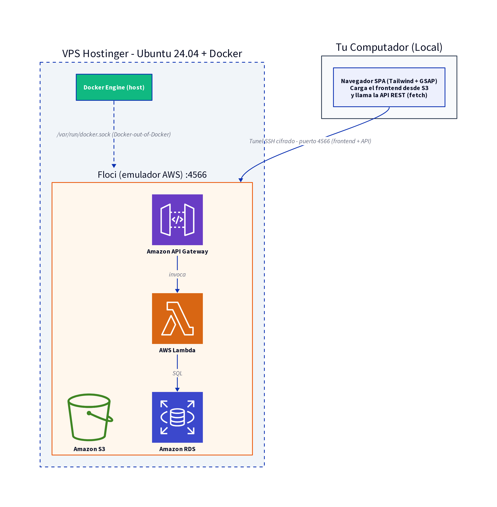

# Guía paso a paso: Quiz de AWS Cloud Practitioner en un VPS remoto

**Para quién es este documento:** para quien ya hizo [`GUIA-LOCAL-DOCKER.md`](./GUIA-LOCAL-DOCKER.md) (o ya conoce los conceptos de Lambda/IAM/RDS/API Gateway que ahí se explican) y ahora quiere desplegar el mismo Quiz en un **servidor remoto compartido** en vez de su propia máquina. Este documento **no repite los conceptos ni la tabla "Floci vs. AWS real"** — viven en la guía local. Acá el foco es exclusivamente la diferencia: el túnel SSH, y el día a día de mantener este entorno arriba (la parte que sí es específica de compartir un VPS, no de aprender AWS).

Diagrama de arquitectura: [Arquitectura Quiz - AWS Cloud Practitioner](https://lucid.app/lucidchart/ef357963-ac6c-4ab1-a152-466ba54fc490/edit) (ver también la sección 1, más abajo, con la imagen incrustada).

---

## Índice

1. [Arquitectura general (VPS)](#1-arquitectura-general-vps)
2. [Cómo levantar el entorno y qué hacer si no arranca](#2-cómo-levantar-el-entorno-y-qué-hacer-si-no-arranca)
3. [Paso 1 — Modelo de datos](#paso-1--modelo-de-datos)
4. [Paso 2 — Base de datos (RDS)](#paso-2--base-de-datos-rds)
5. [Paso 3 — Cargar los datos](#paso-3--cargar-los-datos)
6. [Paso 4 — Las funciones Lambda](#paso-4--las-funciones-lambda)
7. [Paso 5 — API Gateway](#paso-5--api-gateway)
8. [Paso 6 — Frontend (Tailwind + GSAP + S3)](#paso-6--frontend-tailwind--gsap--s3)
9. [Flujo completo de una partida](#9-flujo-completo-de-una-partida)

---

## 1. Arquitectura general (VPS)



Diagrama editable: [Arquitectura Quiz - AWS Cloud Practitioner](https://lucid.app/lucidchart/ef357963-ac6c-4ab1-a152-466ba54fc490/edit)

Resumen del flujo: tu navegador (con el túnel SSH activo) carga el frontend estático desde S3, y llama a la API (API Gateway → Lambda → RDS) para todo lo dinámico. Floci corre como un contenedor Docker en el VPS, y usa el socket de Docker del host para levantar los contenedores reales de Lambda y RDS. Para la variante sin VPS/túnel (y para el diagrama de cómo se vería en una cuenta de AWS real, con VPC/Región/AZ), ver [`GUIA-LOCAL-DOCKER.md` §3](./GUIA-LOCAL-DOCKER.md#3-arquitectura-general).

---

## 2. Cómo levantar el entorno y qué hacer si no arranca

Esta sección es para el **día a día** (no para la primera vez que se construye el proyecto): qué hacer cada vez que te sientas a trabajar, y cómo diagnosticar por qué "no anda" cuando ya estaba desplegado y de repente dejó de responder — que es justo la situación más común y más confusa, porque **hay dos cosas independientes que tienen que estar arriba a la vez**, y solo una de ellas vive en el VPS.

> **Desde 2026-07-05, esto solo aplica a tareas administrativas** (desplegar una Lambda, crear un bucket, correr `aws cli`). **Jugar el Quiz ya no requiere túnel ni que tu equipo esté encendido**: es accesible con HTTPS real, para cualquiera, en `https://floci.devera.cloud/site/quiz-frontend/` — ver el detalle en [`proyectos/quiz-avanzado/docs/GUIA-SERVICIOS-AVANZADOS.md` §1](../../quiz-avanzado/docs/GUIA-SERVICIOS-AVANZADOS.md#1-nginx--dns-exposición-pública-controlada) (la documentación de servicios avanzados vive en ese proyecto). El resto de esta sección (2.1 a 2.5) sigue siendo válido tal cual para cuando vos mismo necesitás trabajar sobre Floci.

### 2.1 Las dos piezas que tienen que estar levantadas

| Pieza | Dónde corre | Se cae por | Sobrevive un reinicio del VPS |
|---|---|---|---|
| **Contenedor de Floci** (`floci-floci-1`) | En el VPS, como cualquier proyecto Docker | Que el VPS se reinicie sin que Docker levante el contenedor solo, o que el contenedor crashee por un error interno | **Sí**, configurado con `restart: unless-stopped` (ver `plataforma/PLAN.md`) |
| **Túnel SSH** (`ssh -L 4566:localhost:4566 ...`) | En **tu equipo local** (el que ejecuta `aws` / el navegador), no en el VPS | Cerrar la terminal, apagar/hibernar/reiniciar tu máquina, reiniciar WSL, cortes de red | **No** — es un proceso normal en tu máquina, nadie lo reinicia automáticamente |

Esto explica el caso típico: **"en Docker el servicio de Floci está corriendo, pero el quiz no carga"**. Si el contenedor está `Up` en el VPS pero tu máquina no tiene el túnel activo en este momento (por ejemplo, porque reiniciaste tu equipo o cerraste la sesión desde la última vez), tu navegador y tu AWS CLI simplemente no tienen forma de llegar a `localhost:4566` — no es que Floci esté caído, es que **no hay nadie escuchando ese puerto en tu propia máquina**. Se ve exactamente igual desde afuera (todo "no responde"), pero la causa y el arreglo son distintos.

### 2.2 Levantar el entorno, paso a paso, cada vez que empiezas a trabajar

**1. Verifica el contenedor de Floci en el VPS** (por SSH, o desde el Docker Manager del panel de Hostinger):

```bash
ssh root@<TU-IP-VPS> "docker ps --filter name=floci"
```

Debería aparecer `floci-floci-1` con estado `Up ... (healthy)`. Si no aparece o está `Exited`, ver el punto 2.3.

**2. Levanta (o vuelve a levantar) el túnel SSH desde tu equipo local:**

```bash
ssh -f -N -L 4566:localhost:4566 root@<TU-IP-VPS>
```

`-f` lo manda a segundo plano, `-N` indica que no se va a ejecutar ningún comando remoto, solo reenviar el puerto. Este comando **hay que repetirlo cada vez** que tu máquina se reinicia o la sesión se corta — no queda "instalado", ver 2.4 para dejarlo automatizado.

**3. Confirma que el túnel realmente quedó escuchando en tu máquina:**

```bash
ss -tlnp | grep 4566          # Linux/WSL — deberías ver 127.0.0.1:4566
# o, si ss no está disponible:
lsof -iTCP:4566 -sTCP:LISTEN
```

Si no aparece nada, el túnel no se estableció (revisa el mensaje de error del `ssh` del paso 2 — la causa más común es la clave SSH o la IP del VPS).

**4. Confirma que Floci responde a través del túnel:**

```bash
curl http://localhost:4566/_localstack/health
```

Debe devolver un JSON con todos los servicios en `"running"`. Si esto fallara (`curl: (7) Failed to connect`) con el túnel ya confirmado arriba en el paso 3, el problema pasó a estar del lado del contenedor (volver a 2.3).

**5. Prueba específicamente el Quiz (frontend + API), no solo la salud genérica de Floci:**

```bash
curl -sI http://quiz-frontend.s3-website.us-east-1.localhost:4566/          # frontend (S3)
curl -s  http://localhost:4566/restapis/f3744ef7e3/\$default/_user_request_/categories  # API (reemplaza el api_id si cambió)
```

Si el paso 4 respondió bien pero alguno de estos dos falla, el problema es específico del Quiz (bucket borrado, API Gateway recreada con otro `api_id`, RDS caída), no de Floci en general — sigue en 2.3 con el chequeo puntual que corresponda.

### 2.3 Diagnóstico cuando algo específico no arranca

| Síntoma | Causa más probable | Qué hacer |
|---|---|---|
| Nada responde, ni `_localstack/health` | Túnel SSH no está activo en tu máquina (ver 2.1) | Repetir el paso 2 de 2.2. Es, con diferencia, la causa más frecuente — y la que **no** se ve revisando Docker en el VPS, porque el túnel no vive ahí |
| `_localstack/health` responde pero con timeout intermitente o `503` | El contenedor de Floci está reiniciándose o sin recursos (RAM/CPU) | En el VPS: `docker logs floci-floci-1 --tail 100` y `docker stats` para descartar que el VPS se quedó sin RAM (recordar que cada Lambda/RDS activa suma contenedores hermanos reales) |
| Floci sano, pero `categories`/`ranking` devuelven error 500 o timeout | La RDS (contenedor Postgres real, hermano de Floci) no está levantada o no es alcanzable en `floci_default` | En el VPS: `docker ps | grep postgres` y, si hace falta, `aws rds describe-db-instances --profile floci` (ejecutado en el VPS, donde sí hay línea directa a `172.22.0.2:7001`) |
| Floci sano, pero la API Gateway devuelve `{"message":"Not Found"}` o `NoSuchBucket` | `api_id` cambiado (la API se volvió a crear) o ruta mal escrita — recordar el patrón exacto `_user_request_` (ver [`GUIA-LOCAL-DOCKER.md` §4](./GUIA-LOCAL-DOCKER.md#4-floci-vs-aws-real-qué-cambia)) | `aws apigatewayv2 get-apis --profile floci` para confirmar el `api_id` vigente y actualizar `API_BASE` en `frontend/app.js` si cambió |
| El frontend carga pero muestra datos viejos o no refleja un cambio recién subido | Caché del navegador (los objetos S3 se suben con `--cache-control "no-cache"`, pero un despliegue viejo sin ese header pudo quedar cacheado) | `Ctrl+Shift+R` / ventana privada; confirmar que el último `aws s3 cp` incluyó `--cache-control "no-cache"` |
| `ssh: connect to host ... port 22: Connection refused/timed out` al intentar el túnel | El VPS está apagado/reiniciando, o cambió de IP, o hay un firewall bloqueando | Verificar el estado del VPS desde el panel de Hostinger antes de sospechar de Floci |

### 2.4 Cómo dejarlo levantado de forma más permanente

- **El contenedor de Floci** ya está resuelto: `restart: unless-stopped` en su `docker-compose.yml` hace que Docker lo vuelva a levantar solo si el VPS se reinicia o si el proceso muere. No requiere acción de tu parte.
- **El túnel SSH era la pieza que realmente se caía seguido**, porque es un proceso en tu propio equipo, no en el VPS — `ssh -f -N -L ...` no se reconecta solo si la red se corta ni sobrevive a que reinicies tu máquina. Esto ya está resuelto de forma permanente con `autossh` + un servicio de `systemd` (implementado el 2026-07-04, tras justamente quedar caído por esta causa):

  - **`plataforma/.env`** (ignorado por git, plantilla en `plataforma/.env.example`) guarda `FLOCI_VPS_HOST`, `FLOCI_VPS_USER`, `FLOCI_LOCAL_PORT`, `FLOCI_REMOTE_PORT` — así la IP real del VPS nunca queda en un archivo versionado.
  - **`plataforma/scripts/floci-tunnel.sh`** lee ese `.env` y ejecuta `autossh -M 0 -N` con *keep-alives* (`ServerAliveInterval`/`ServerAliveCountMax`) hacia el túnel, en primer plano (para que un supervisor de procesos lo controle).
  - **`plataforma/systemd/floci-tunnel.service`** (plantilla committeada, con `<RUTA-AL-REPO>` como placeholder) es la unidad de `systemd` que ejecuta ese script con `Restart=always` — si el túnel se cae por cualquier motivo (red, la sesión SSH expira, el proceso muere), `systemd` lo relanza solo en unos segundos, sin intervención manual. Instalado en este equipo en `/etc/systemd/system/floci-tunnel.service` (ruta real, no versionada, ya que `/etc` no es parte del repo).

  **Instalar esto en un equipo nuevo** (otra máquina desde la que también quieras acceder a Floci):
  ```bash
  cd plataforma
  cp .env.example .env && nano .env   # completar FLOCI_VPS_HOST real
  chmod +x scripts/floci-tunnel.sh
  sudo sed "s|<RUTA-AL-REPO>|$(pwd)/..|" systemd/floci-tunnel.service | sudo tee /etc/systemd/system/floci-tunnel.service
  sudo systemctl daemon-reload
  sudo systemctl enable --now floci-tunnel.service
  ```
  **Operar el servicio día a día:**
  ```bash
  systemctl status floci-tunnel.service   # ver si está activo
  journalctl -u floci-tunnel.service -f   # ver logs / reconexiones en vivo
  sudo systemctl restart floci-tunnel.service
  ```
  Con esto, el túnel queda arriba automáticamente mientras la máquina esté encendida (arranca con `systemd` al iniciar, y se reconecta solo ante cortes) — ya no depende de acordarte de correr el `ssh -f -N` manual del paso 2 de 2.2.

  > **Límite conocido, no resuelto por esto**: en WSL, `systemd` solo corre mientras la instancia de WSL está activa, y WSL no arranca sola con Windows salvo que se configure aparte (Tarea Programada de Windows, o `wsl --exec` al inicio de sesión). Si tras reiniciar Windows el túnel sigue sin responder, lo primero es abrir una terminal de WSL (eso ya activa la instancia y, con ella, el servicio) antes de sospechar de Floci o del VPS.

  **Esto ya se hizo** (2026-07-05): las rutas puntuales del Quiz (frontend S3 + `/restapis/.../_user_request_/*`) se expusieron a través del `nginx-proxy-manager` ya activo en el VPS, con HTTPS real, eliminando la dependencia del túnel SSH por completo para el uso normal del Quiz — ver la sección 2.5 más abajo y el detalle técnico completo en [`proyectos/quiz-avanzado/docs/GUIA-SERVICIOS-AVANZADOS.md` §1](../../quiz-avanzado/docs/GUIA-SERVICIOS-AVANZADOS.md#1-nginx--dns-exposición-pública-controlada) (documentación de servicios avanzados, que vive en ese proyecto para no duplicarla).

### 2.5 Qué resuelve realmente el túnel persistente — y qué no

Es importante no confundir "el túnel ya no se cae solo" con "ya no dependo de mi equipo". Son cosas distintas, y vale la pena entender **cómo funciona un túnel SSH de reenvío local** (`-L`, *local port forwarding*) para ver por qué la segunda sigue siendo cierta.

Al ejecutar `ssh -L 4566:localhost:4566 root@<TU-IP-VPS>` pasa esto:

1. El cliente `ssh` abre una conexión normal (autenticada, cifrada) hacia el VPS.
2. Le pide al servidor SSH del VPS: "todo lo que yo te mande por este canal, reenvíalo a tu propio `localhost:4566`" — que es exactamente donde Floci escucha del lado del VPS (`docker-compose.yml` lo publica solo en `127.0.0.1:4566:4566`, nunca en `0.0.0.0`, para que no sea alcanzable desde fuera del propio VPS).
3. En **tu máquina**, el proceso `ssh` abre un socket que escucha en `127.0.0.1:4566`.
4. Cuando `curl`, `aws` o el navegador se conectan a ese `127.0.0.1:4566` local, `ssh` toma esos bytes, los mete en el túnel cifrado, el servidor SSH del VPS los entrega a su propio `localhost:4566` (Floci), y la respuesta vuelve por el mismo camino en sentido inverso.

```
tu app (curl/aws/navegador)
        │  conecta a 127.0.0.1:4566 (local)
        ▼
proceso ssh en TU máquina  ── canal SSH cifrado ──►  proceso sshd en el VPS
                                                              │  entrega a
                                                              ▼
                                                    localhost:4566 del VPS (Floci)
```

Versión detallada (diagrama de secuencia):


El punto clave: **no es que el VPS abra el puerto 4566 al mundo** — es que tu propia máquina finge tener ese puerto abierto localmente, y todo viaja disfrazado dentro de la sesión SSH. Para que eso funcione tiene que existir, en algún lugar, un proceso `ssh` con esa sesión abierta. Antes, ese "algún lugar" era una terminal que vos abrías a mano; ahora es un servicio de `systemd` — pero en los dos casos, **el proceso vive en tu equipo**, no en el VPS.

Por eso `autossh` + `systemd` resuelven un problema (que el túnel se caiga por un corte de red o por olvidarte de reabrirlo) pero no resuelven el otro (que tu máquina, y con ella la instancia de WSL donde vive el servicio, tiene que estar encendida para que el proceso exista). Si apagás la laptop, no hay proceso `ssh` en ningún lado sosteniendo la sesión — Floci puede estar perfectamente sano en el VPS y aun así ser inalcanzable, porque el "lado cliente" del túnel simplemente no existe.

La única forma de eliminar esa dependencia de fondo es mover el punto de entrada al lado que sí está siempre encendido (el VPS), publicando las rutas exactas a través de un proxy con HTTPS en vez de un túnel SSH — la Fase 1 mencionada arriba.

**Actualización 2026-07-05: esa fase ya se implementó** (ver [`proyectos/quiz-avanzado/docs/GUIA-SERVICIOS-AVANZADOS.md` §1](../../quiz-avanzado/docs/GUIA-SERVICIOS-AVANZADOS.md#1-nginx--dns-exposición-pública-controlada)) — el Quiz se sirve directamente desde el VPS vía `nginx-proxy-manager` (`https://floci.devera.cloud/...`), así que **para que otras personas jueguen, "¿está el túnel arriba?" ya no es la pregunta relevante**: el VPS responde solo, esté tu equipo encendido o no. Lo que sigue siendo cierto es todo lo de arriba (2.1 a 2.4) para el otro caso de uso, el tuyo como administrador: crear un bucket nuevo, desplegar una Lambda, correr `aws cli` — eso pasa por rutas de gestión de Floci que **deliberadamente nunca se expusieron** (ver la nota de seguridad de esa misma sección), así que para eso el túnel SSH sigue siendo, y va a seguir siendo, imprescindible.

---

## Paso 1 — Modelo de datos

Archivo: [`db/schema.sql`](../db/schema.sql)

```sql
CREATE TABLE categorias (
    id SERIAL PRIMARY KEY,
    nombre TEXT NOT NULL,
    slug TEXT NOT NULL UNIQUE
);

CREATE TABLE preguntas (
    id INTEGER PRIMARY KEY,
    categoria_id INTEGER NOT NULL REFERENCES categorias(id),
    enunciado TEXT NOT NULL,
    enunciado_en TEXT,
    es_multiple BOOLEAN NOT NULL DEFAULT FALSE
);

CREATE TABLE opciones (
    id SERIAL PRIMARY KEY,
    pregunta_id INTEGER NOT NULL REFERENCES preguntas(id),
    texto TEXT NOT NULL,
    es_correcta BOOLEAN NOT NULL DEFAULT FALSE,
    orden INTEGER NOT NULL
);

CREATE TABLE explicaciones (
    pregunta_id INTEGER PRIMARY KEY REFERENCES preguntas(id),
    explicacion TEXT NOT NULL,
    tip TEXT,
    pistas JSONB,
    glosario JSONB
);

CREATE TABLE ranking (
    id SERIAL PRIMARY KEY,
    username TEXT NOT NULL,
    puntaje INTEGER NOT NULL,
    categoria_id INTEGER NOT NULL REFERENCES categorias(id),
    fecha TIMESTAMPTZ NOT NULL DEFAULT now(),
    avatar TEXT,
    color TEXT,
    aciertos INTEGER,
    total INTEGER,
    mejor_racha INTEGER,
    puesto_logrado INTEGER
);

CREATE INDEX idx_opciones_pregunta ON opciones(pregunta_id);
CREATE INDEX idx_preguntas_categoria ON preguntas(categoria_id);
CREATE INDEX idx_ranking_categoria_puntaje ON ranking(categoria_id, puntaje DESC);

INSERT INTO categorias (nombre, slug) VALUES
    ('AWS Cloud Practitioner', 'aws-cloud-practitioner'),
    ('Python', 'python'),
    ('Linux', 'linux');
```

**Por qué estas decisiones de diseño:**

- `preguntas.id` reutiliza el ID original de la fuente de datos en vez de generar uno nuevo con `SERIAL` — así las referencias entre archivos de origen (preguntas ↔ explicaciones) se mantienen consistentes.
- `pistas` y `glosario` son `JSONB` (tipo nativo de Postgres) en vez de tablas separadas: son datos de solo lectura para mostrar en la UI, normalizarlos en más tablas sería complejidad sin beneficio real.
- `ranking.puesto_logrado` guarda el puesto **en el momento del intento**, no se recalcula después. Esto importa para las medallas "Podio"/"Campeón": si no se guardara, alguien podría perder una medalla ya ganada simplemente porque otro jugador mejoró el ranking más tarde.
- Índices en las columnas que se usan en `WHERE`/`ORDER BY` de las consultas más frecuentes (`opciones.pregunta_id`, `preguntas.categoria_id`, `ranking.categoria_id + puntaje`).

> **En AWS real**: este SQL se ejecuta exactamente igual, ya sea contra RDS Postgres real o Aurora Postgres. No hay ningún cambio necesario aquí.

---

## Paso 2 — Base de datos (RDS)


```bash
aws rds create-db-instance \
  --db-instance-identifier quiz-db \
  --db-instance-class db.t3.micro \
  --engine postgres \
  --engine-version 17 \
  --master-username quizadmin \
  --master-user-password 'TU_PASSWORD_SEGURO' \
  --allocated-storage 20 \
  --db-name quiz \
  --profile floci
```

En Floci, esto responde de inmediato con `"DBInstanceStatus": "available"` y un `Endpoint` — en nuestro caso, una dirección interna de la red Docker (`172.22.0.2:7001`), **no** publicada al host del VPS. Por eso, para ejecutar SQL directo contra ella (aplicar el esquema, cargar datos), lo hacemos **desde el propio VPS**, dentro de un contenedor efímero conectado a la misma red Docker:

```bash
docker run --rm --network floci_default \
  -v /ruta/a/schema.sql:/schema.sql:ro \
  -e PGPASSWORD="tu_password" \
  postgres:17-alpine \
  psql "postgresql://quizadmin@172.22.0.2:7001/quiz" -f /schema.sql
```

> **En AWS real**: el mismo comando `create-db-instance` necesita además `--vpc-security-group-ids` y `--db-subnet-group-name` (para indicar en qué VPC/subnets vive). Y hay que **esperar** (`aws rds wait db-instance-available`) antes de poder conectarte, ya que el aprovisionamiento real toma minutos. Para ejecutar el `schema.sql`, si la RDS no es públicamente accesible (recomendado), necesitas hacerlo desde una instancia EC2/Lambda dentro de la misma VPC, o abrir un túnel a través de un *bastion host*.

---

## Paso 3 — Cargar los datos

Script: [`db/seed.js`](../db/seed.js) — lee los JSON de origen y los inserta respetando el esquema (preguntas, opciones marcando cuál es correcta, explicaciones). Se corre una sola vez:

```bash
docker run --rm --network floci_default \
  -v /ruta/a/db:/app/db -w /app/db \
  -e PGHOST=172.22.0.2 -e PGPORT=7001 -e PGUSER=quizadmin -e PGPASSWORD="tu_password" -e PGDATABASE=quiz \
  node:22-alpine \
  sh -c "npm install --silent && node seed.js"
```

Resultado esperado: `169 preguntas, 697 opciones, 169 explicaciones` cargadas.

> **En AWS real**: igual, solo cambia desde dónde se ejecuta (una máquina con acceso de red a la RDS — VPN, bastion host, o una tarea temporal en la misma VPC).

---

## Paso 4 — Las funciones Lambda


Las 6 funciones comparten el mismo patrón: reciben el evento de API Gateway (formato *payload v2*), parsean el body si es `POST`, hacen su consulta a Postgres con el cliente `pg`, y devuelven `{statusCode, headers, body}`. Todas tienen su propio rol IAM (`quiz-<nombre>-role`) con la misma *trust policy* que ya usamos en el Hello World.

### 4.1 `categories` — `GET /categories`

```javascript
const { Client } = require("pg");

exports.handler = async () => {
  const client = new Client();
  await client.connect();
  try {
    const { rows } = await client.query(`
      SELECT c.slug, c.nombre, COUNT(p.id) > 0 AS tiene_preguntas
      FROM categorias c
      LEFT JOIN preguntas p ON p.categoria_id = c.id
      GROUP BY c.id, c.slug, c.nombre
      ORDER BY c.id
    `);
    return respond(200, rows);
  } finally {
    await client.end();
  }
};

function respond(statusCode, obj) {
  return { statusCode, headers: { "Content-Type": "application/json", "Access-Control-Allow-Origin": "*" }, body: JSON.stringify(obj) };
}
```

Lo interesante: `tiene_preguntas` se calcula con un `COUNT(*)`, no es un flag manual — así, el día que se carguen preguntas de Python o Linux, aparecen automáticamente como "Disponible" sin tocar código.

### 4.2 `questions` — `GET /questions/{categoria}`

Devuelve las preguntas de una categoría **sin** revelar cuál opción es la correcta ni la explicación (eso solo se entrega a través de `/answer`, después de responder).

```javascript
exports.handler = async (event) => {
  const slug = event.pathParameters && event.pathParameters.categoria;
  const client = new Client();
  await client.connect();
  try {
    const catRes = await client.query("SELECT id FROM categorias WHERE slug = $1", [slug]);
    if (catRes.rows.length === 0) return respond(404, { error: "categoria no encontrada" });
    const categoriaId = catRes.rows[0].id;

    const preguntasRes = await client.query(
      "SELECT id, enunciado, es_multiple FROM preguntas WHERE categoria_id = $1 ORDER BY id",
      [categoriaId]
    );
    const opcionesRes = await client.query(
      "SELECT id, pregunta_id, texto FROM opciones WHERE pregunta_id = ANY($1) ORDER BY pregunta_id, orden",
      [preguntasRes.rows.map((p) => p.id)]
    );
    // ... agrupa opciones por pregunta_id y arma la respuesta
  } finally {
    await client.end();
  }
};
```

### 4.3 `answer` — `POST /answer` (la respuesta inmediata)

```javascript
exports.handler = async (event) => {
  const { pregunta_id, opciones_seleccionadas } = JSON.parse(event.body || "{}");
  const client = new Client();
  await client.connect();
  try {
    const opcionesRes = await client.query("SELECT id, es_correcta FROM opciones WHERE pregunta_id = $1", [pregunta_id]);
    const esperadas = new Set(opcionesRes.rows.filter((o) => o.es_correcta).map((o) => o.id));
    const seleccionadas = new Set(opciones_seleccionadas);
    const correcta = esperadas.size === seleccionadas.size && [...esperadas].every((id) => seleccionadas.has(id));

    const explRes = await client.query("SELECT explicacion, tip FROM explicaciones WHERE pregunta_id = $1", [pregunta_id]);
    return respond(200, { correcta, opciones_correctas: [...esperadas], explicacion: explRes.rows[0] || null });
  } finally {
    await client.end();
  }
};
```

Esta función es la clave de la "respuesta inmediata": se llama **una vez por pregunta respondida**, no al final. Revela la corrección de esa pregunta puntual — nunca las demás, que el usuario todavía no vio.

### 4.4 `submit` — `POST /submit` (calcula puntaje, racha, puesto y medallas)

```javascript
const PUNTOS_BASE = 100;
const BONUS_POR_RACHA = 20;

exports.handler = async (event) => {
  const { username, categoria, respuestas } = JSON.parse(event.body || "{}");
  const avatar = AVATARES_VALIDOS.has(body.avatar) ? body.avatar : null;
  const color = COLORES_VALIDOS.has(body.color) ? body.color : null;

  const client = new Client();
  await client.connect();
  try {
    // 1. Trae que opciones son correctas para cada pregunta respondida
    // 2. Recorre las respuestas EN ORDEN, recalculando correcta/incorrecta
    //    (nunca confia en lo que diga el cliente), acumulando puntaje y racha:
    let racha = 0, mejorRacha = 0, aciertos = 0, puntaje = 0;
    for (const r of respuestas) {
      const esCorrecta = /* comparar r.opciones_seleccionadas contra la BD */;
      if (esCorrecta) {
        racha += 1; aciertos += 1;
        puntaje += PUNTOS_BASE + BONUS_POR_RACHA * (racha - 1);
        mejorRacha = Math.max(mejorRacha, racha);
      } else {
        racha = 0;
      }
    }
    // 3. Calcula el puesto ANTES de insertar (cuenta cuantos ya tienen mas puntaje)
    const puesto = /* COUNT(*) WHERE categoria_id=X AND puntaje > este_puntaje, + 1 */;

    // 4. Inserta la fila (incluyendo avatar, color, puesto_logrado)
    // 5. Calcula las 7 medallas consultando TODO el historial del username
    // 6. Devuelve { puntaje, aciertos, total, mejor_racha, puesto, total_jugadores, medallas }
  } finally {
    await client.end();
  }
};
```

Código completo: [`lambda/submit/index.js`](../lambda/submit/index.js).

### 4.5 `ranking` — `GET /ranking?categoria=X`

```sql
SELECT r.username, r.puntaje, r.avatar, r.color, r.aciertos, r.total, r.mejor_racha, c.slug AS categoria, r.fecha
FROM ranking r JOIN categorias c ON c.id = r.categoria_id
WHERE c.slug = $1
ORDER BY r.puntaje DESC, r.fecha ASC
LIMIT 20
```

### 4.6 `badges` — `GET /badges?username=X` (medallas/logros)

Evalúa **todo el historial** del username (todas las categorías, todos los intentos) con una sola consulta agregada:

```sql
SELECT
  BOOL_OR(aciertos::float / NULLIF(total, 0) >= 0.5) AS aprobado,
  BOOL_OR(aciertos = total) AS sin_fallos,
  BOOL_OR(mejor_racha >= 5) AS en_racha,
  BOOL_OR(aciertos < total AND aciertos::float / NULLIF(total, 0) >= 0.7) AS remontada,
  BOOL_OR(puesto_logrado <= 3) AS podio,
  BOOL_OR(puesto_logrado = 1) AS campeon,
  BOOL_OR(total >= 30) AS maraton
FROM ranking
WHERE username = $1
```

### Desplegar cada Lambda (mismo patrón que el Hello World, x6)

```bash
# Rol IAM (una vez por funcion)
aws iam create-role --role-name quiz-categories-role --assume-role-policy-document '{
  "Version": "2012-10-17",
  "Statement": [{"Effect": "Allow", "Principal": {"Service": "lambda.amazonaws.com"}, "Action": "sts:AssumeRole"}]
}' --profile floci

# Empaquetar (incluye node_modules con la libreria pg)
cd lambda/categories && npm install && zip -r function.zip index.js package.json node_modules

# Publicar, con las credenciales de RDS como variables de entorno
aws lambda create-function \
  --function-name quiz-categories \
  --runtime nodejs22.x \
  --role arn:aws:iam::000000000000:role/quiz-categories-role \
  --handler index.handler \
  --zip-file fileb://function.zip \
  --environment 'Variables={PGHOST=172.22.0.2,PGPORT=7001,PGUSER=quizadmin,PGPASSWORD=tu_password,PGDATABASE=quiz}' \
  --profile floci
```

Se repite para `questions`, `answer`, `submit`, `ranking`, `badges`.


> **En AWS real**: agregar `--vpc-config SubnetIds=subnet-xxx,subnet-yyy,SecurityGroupIds=sg-xxx` para que la Lambda pueda alcanzar la RDS (están en la misma VPC), y usar Secrets Manager para `PGPASSWORD` en vez de una variable de entorno plana.

---

## Paso 5 — API Gateway


```bash
# 1. Crear la API HTTP con CORS
aws apigatewayv2 create-api --name quiz-api --protocol-type HTTP \
  --cors-configuration AllowOrigins="*",AllowMethods="GET,POST,OPTIONS",AllowHeaders="content-type" \
  --profile floci
# -> guarda el ApiId devuelto

# 2. Por cada Lambda: integracion + ruta + permiso
aws apigatewayv2 create-integration --api-id $API_ID \
  --integration-type AWS_PROXY \
  --integration-uri arn:aws:lambda:us-east-1:000000000000:function:quiz-categories \
  --payload-format-version 2.0 --profile floci
# -> guarda el IntegrationId

aws apigatewayv2 create-route --api-id $API_ID --route-key "GET /categories" \
  --target integrations/$INTEGRATION_ID --profile floci

aws lambda add-permission --function-name quiz-categories \
  --statement-id apigw-invoke --action lambda:InvokeFunction \
  --principal apigateway.amazonaws.com \
  --source-arn "arn:aws:execute-api:us-east-1:000000000000:${API_ID}/*/*" \
  --profile floci

# 3. Repetir el paso 2 para: GET /questions/{categoria}, POST /answer,
#    POST /submit, GET /ranking, GET /badges

# 4. Crear el stage
aws apigatewayv2 create-stage --api-id $API_ID --stage-name '$default' --auto-deploy --profile floci
```

**Invocar la API**: en Floci, el patrón de invocación (descubierto empíricamente, no documentado) es:

```
http://localhost:4566/restapis/{api_id}/$default/_user_request_/{ruta}
```


> **En AWS real**: la URL de invocación es simplemente `https://{api_id}.execute-api.{region}.amazonaws.com/{ruta}` (con `$default` como stage implícito) — no hace falta ningún patrón especial ni túnel, es una URL pública HTTPS normal.

---

## Paso 6 — Frontend (Tailwind + GSAP + S3)


### Estructura

```
frontend/
├── index.html          # se sube a S3
├── style.css           # se sube a S3 (compilado, NO se edita a mano)
├── app.js              # se sube a S3
├── src/input.css       # fuente de Tailwind, NO se sube
├── package.json        # build de Tailwind, NO se sube
└── node_modules/       # NO se sube
```

### Build de Tailwind (v4)

```bash
cd frontend
npm install
npm run build:css   # tailwindcss -i src/input.css -o style.css --minify
```

`src/input.css`:
```css
@import "tailwindcss";
@source "../index.html";
@source "../app.js";

/* Modo oscuro por clase (no por prefers-color-scheme directo), para poder
   ofrecer un boton manual claro/oscuro/sistema */
@custom-variant dark (&:where(.dark, .dark *));
```

### Patrón de la aplicación (SPA sin framework)

`app.js` es una única función `render(html)` que reemplaza el contenido de un `<div id="screen-root">` completo cada vez que cambias de pantalla, más 7 funciones `render<Pantalla>()` (Landing, Categorías, Nivel, Perfil, Pregunta, Resultado, Ranking) que arman el HTML como *template strings* y enganchan sus propios `addEventListener`. No hay Virtual DOM ni framework: se opta por simplicidad dado el tamaño del proyecto.

Ejemplo (llamada a la API + manejo de errores, reutilizado en todas las pantallas):

```javascript
async function api(path, options) {
  const res = await fetch(API_BASE + path, options);
  const data = await res.json().catch(() => null);
  if (!res.ok) throw new Error((data && data.error) || `Error de red (${res.status})`);
  return data;
}
```

### GSAP (animaciones)

Cargado por CDN en `index.html` (`<script src="https://cdn.jsdelivr.net/npm/gsap@3.12.5/dist/gsap.min.js">`), sin paso de build. Usado para: transición entre pantallas, barra de progreso, contador del puntaje final, y el confeti de celebración:

```javascript
function celebrarConfeti() {
  if (typeof gsap === "undefined") return; // si el CDN no cargo, sigue funcionando sin animar
  const contenedor = document.createElement("div");
  contenedor.className = "fixed inset-0 pointer-events-none z-50 overflow-hidden";
  document.body.appendChild(contenedor);
  const piezas = [];
  for (let i = 0; i < 70; i++) {
    const pieza = document.createElement("div");
    pieza.style.cssText = `position:absolute;top:-20px;left:${Math.random() * 100}%;width:8px;height:8px;background:${COLORES[i % COLORES.length]};border-radius:50%;`;
    contenedor.appendChild(pieza);
    piezas.push(pieza);
  }
  gsap.to(piezas, {
    y: () => window.innerHeight + 60,
    rotation: () => Math.random() * 720 - 360,
    opacity: 0,
    duration: () => 1.8 + Math.random() * 1.2,
    stagger: 0.008,
    onComplete: () => contenedor.remove(),
  });
}
```

### Desplegar a S3

```bash
aws s3 mb s3://quiz-frontend --profile floci
aws s3api put-bucket-website --bucket quiz-frontend \
  --website-configuration '{"IndexDocument":{"Suffix":"index.html"}}' --profile floci

# Solo los 3 archivos servidos, con --cache-control para que las
# actualizaciones se reflejen de inmediato en el navegador
aws s3 cp index.html s3://quiz-frontend/index.html --cache-control "no-cache" --profile floci
aws s3 cp style.css s3://quiz-frontend/style.css --cache-control "no-cache" --profile floci
aws s3 cp app.js s3://quiz-frontend/app.js --cache-control "no-cache" --profile floci
```

Acceso: `http://quiz-frontend.s3-website.us-east-1.localhost:4566/` (a través del túnel SSH).

**Con esto, la arquitectura completa ya está funcionando de punta a punta:**


> **En AWS real**: el bucket necesita una **bucket policy** que permita lectura pública (`s3:GetObject` para `Principal: "*"`), ya que por defecto todos los buckets S3 son privados. La mejor práctica es no hacer el bucket público directamente, sino ponerlo detrás de **CloudFront** (con *Origin Access Control*), que además te da HTTPS, CDN (caché en distintas ubicaciones geográficas) y la posibilidad de un dominio propio.

---

## 9. Flujo completo de una partida

1. El navegador pide `GET /categories` → arma la pantalla de categorías (Python/Linux se ven "Próximamente" porque `tiene_preguntas` es `false`).
2. Usuario elige categoría → cantidad de preguntas → nombre + avatar + color (con `GET /badges?username=X` en vivo mientras escribe, con debounce de 400ms).
3. `GET /questions/{categoria}` trae las preguntas (sin respuestas correctas). El frontend las mezcla (`shuffle`) y toma el subconjunto elegido.
4. Por cada pregunta: el usuario responde → `POST /answer` revela si acertó + explicación → el frontend actualiza el contador de puntos/racha en vivo (solo visual) → botón "Siguiente pregunta".
5. Al terminar: `POST /submit` con **todas** las respuestas → el servidor recalcula todo desde cero, guarda la fila en `ranking`, devuelve puntaje/puesto/medallas definitivos → se dispara el conteo animado + confeti.
6. `GET /ranking?categoria=X` para ver la clasificación.

---

Para el checklist de despliegue en AWS real y el glosario, ver
[`GUIA-LOCAL-DOCKER.md` §15 y §16](./GUIA-LOCAL-DOCKER.md#15-checklist-para-desplegar-en-aws-real) —
son independientes de si trabajaste en local o en este VPS.
